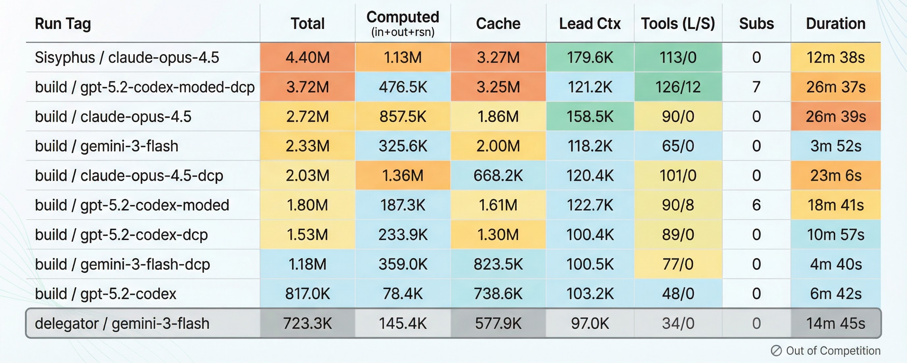

# OpenCode Agent Evaluator

A CLI tool to benchmark AI coding agents running on [OpenCode](https://github.com/opencode-ai/opencode). Compare different agent configurations and track where tokens actually go.

## REMARK: This is NOT build by or affiliated with the OpenCode Team ("anomalyco")

## Features

- **Token tracking**: Input, output, reasoning, and cache tokens per session
- **Session labeling**: LEAD, SUB #1, SUB #2 etc. to follow agent hierarchy
- **Tool call analysis**: Estimates tokens consumed by tool calls vs reasoning
- **Structured output**: YAML metrics for programmatic analysis
- **Analysis script**: Aggregate and compare multiple benchmark runs

## Prerequisites

- Node.js 18+
- A running [OpenCode](https://github.com/opencode-ai/opencode) TUI instance

## Quick Start

```bash
# Install dependencies
npm install
npm run build

# Start OpenCode TUI in your target project
cd /path/to/your/project && opencode

# Run the evaluator (in another terminal)
node dist/index.js -c config.yaml
```

## Configuration

Copy `config.example.yaml` to `config.yaml`:

```yaml
runId: "my-test-run"
agent: "build"
model:
  id: "openai:gpt-4o"
  contextWindow: 128000
  outputLimit: 4096
path: "/path/to/your/project"
outputDir: "./out"
baseUrl: "http://127.0.0.1:4096"
prompts:
  - "Your prompt here"
```

> **Important:** The evaluator connects to OpenCode's TUI web server (port 4096). Do NOT use `opencode serve` – it has an incompatible response format.

## Output

Results are saved to `out/{runId}/`:
- `metrics.yaml` – structured token usage per session
- `log.txt` – full conversation log

## Benchmark Results

Results from running the Phoenix benchmark with different agents and models (latest run: January 23, 2026):



**Columns:**
- **Total**: All tokens (input + output + reasoning + cache)
- **Computed**: Billable tokens (input + output + reasoning)
- **Cache**: Cache read tokens
- **Lead Ctx**: Context window usage by lead agent
- **Tools (L/S)**: Tool calls by Lead / Subagents
- **Subs**: Number of subagent sessions

**Agents:**
- **Sisyphus**: Running with oh-my-opencode
- **build**: Standard build agent from OpenCode
- **delegator**: Proof-of-concept delegator agent (plugin not yet published)

**Prompt Variants:**
- **codex modded**: Optimized codex prompt with subagent-encouragement
- **codex**: The new standard codex prompt (since early 2026)
- **dcp**: DCP Plugin enabled

**Interpretations:**
- **oh-my-opencode**: Doesn't spawn subagents, but seems generous (af) with tokens based on its prompt design.
- **dcp**: Brings value to Opus and Gemini Flash – lowers context and cache usage as expected. However, for Opus it increases computed tokens, which could drain your token budget or increase costs on API.
- **codex**: The new codex prompt is remarkably efficient. DCP reduces quality here – expected, since the Responses API already optimizes in the background.

## Analyzing Results

Use the analysis script to aggregate metrics from multiple runs:

```bash
npx tsx scripts/analyze-runs.ts ./out
```

Output example:

| Run Tag | Total | Computed (in+out+rsn) | Cache | Lead Ctx | Tools (L/S) | Subs | Duration |
|---------|-------|-----------------------|-------|----------|-------------|------|----------|
| build / gpt-5.2-codex | 817.0K | 78.4K | 738.6K | 103.2K | 48/0 | 0 | 6m 42s |
| build / gemini-3-flash | 2.33M | 325.6K | 2.00M | 118.2K | 65/0 | 0 | 3m 52s |

**Legend:**
- **Total**: All tokens (input + output + reasoning + cache)
- **Computed**: Billable tokens (input + output + reasoning)
- **Cache**: Cache read tokens
- **Lead Ctx**: Context window usage by lead agent
- **Tools (L/S)**: Tool calls by Lead / Subagents
- **Subs**: Number of subagent sessions

---

## Included Benchmarks

This repository includes two benchmark projects for evaluating AI coding agents:

| Project | Phases | Description |
|---------|--------|-------------|
| **Chimera** | 0–3 | Order processing backend – Exploration, Bugfix, Logging, Hooks |
| **Phoenix** | 0–4 | Based on Chimera but more complex – adds Input Validation phase |

Both projects follow the same concept: a realistic backend codebase with incremental improvement tasks. Phoenix is derived from the same test data as Chimera but presents a more challenging benchmark with additional complexity, less hints and more code.
Remark: Both projects are not real, they are generated by Gemini. For more realistic benchmarks, things like UI code is missing.

### Running a Benchmark

The easiest way is using the `run-benchmark.sh` script:

```bash
# Run Phoenix full benchmark with default model
./scripts/run-benchmark.sh

# Run specific phase with custom agent/model
./scripts/run-benchmark.sh -a coder -m openai:gpt-4o phase1

# Run Chimera benchmark
./scripts/run-benchmark.sh -p chimera

# Continue existing testbed (no reset)
./scripts/run-benchmark.sh -c phase2

# Tag the run for comparison
./scripts/run-benchmark.sh -t with-plugin phase1
```

### Manual Benchmark Execution

```bash
# 1. Create testbed from baseline
./scripts/testbed.sh create my-test -b phoenix/baseline

# 2. Start OpenCode TUI in testbed
cd testbeds/my-test && opencode

# 3. Run benchmark (in another terminal)
TESTBED_PATH=$(pwd)/testbeds/my-test \
  node dist/index.js -c benchmarks/phoenix/full_benchmark.yaml
```

### Testbed Management

```bash
./scripts/testbed.sh create <name> [-b baseline]  # Create new testbed
./scripts/testbed.sh reset <name>                 # Reset to baseline
./scripts/testbed.sh diff <name>                  # Show changes
./scripts/testbed.sh snapshot <name> <checkpoint> # Save checkpoint
./scripts/testbed.sh restore <name> <checkpoint>  # Restore checkpoint
./scripts/testbed.sh clean <name>                 # Remove testbed
./scripts/testbed.sh baselines                    # List available baselines
```

### Project Structure

```
.
├── src/                    # Evaluator source code
├── scripts/
│   ├── analyze-runs.ts     # Aggregate metrics from multiple runs
│   ├── run-benchmark.sh    # Convenience script for benchmarks
│   └── testbed.sh          # Testbed management
├── benchmarks/
│   ├── phoenix/
│   │   ├── baseline/       # Project source with OPTI_SPEC.md
│   │   ├── full_benchmark.yaml
│   │   └── phases/         # phase0.yaml through phase4.yaml
│   └── chimera/
│       ├── baseline/
│       ├── full_benchmark.yaml
│       └── phases/
├── config.example.yaml     # Example configuration
└── out/                    # Output directory (git-ignored)
```

## License

MIT - © 2026 DDM – Das Digitale Momentum GmbH & Co KG
